## Spis Treści

1. [Wymagania systemu informacyjnego](#wymagania-systemu-informacyjnego)
   - [Zakres działania i funkcjonalności](#zakres-działania-i-funkcjonalności)
   - [Ograniczenia systemu](#ograniczenia-systemu)
2. [Opis użytego algorytmu](#opis-użytego-algorytmu)
   - [Charakterystyka algorytmu ewolucyjnego/genetycznego](#charakterystyka-algorytmu-ewolucyjnegogenetycznego)
   - [Miary jakości optymalizacji](#miary-jakości-optymalizacji)
3. [Szczegółowy opis implementacji](#szczegółowy-opis-implementacji)
   - [Struktura kodu](#struktura-kodu)
   - [Opis przyjętych rozwiązań](#opis-przyjętych-rozwiązań)
4. [Instrukcja użytkowania systemu informacyjnego](#instrukcja-użytkowania-systemu-informacyjnego)
   - [Uruchomienie kodu](#uruchomienie-kodu)
   - [Korzystanie z interfejsu](#korzystanie-z-interfejsu)
   - [Przykłady użycia](#przykłady-użycia)
5. [Spis literatury](#spis-literatury)

## Wymagania systemu informacyjnego

### Zakres działania i funkcjonalności

System informacyjny realizuje optymalizację portfela inwestycyjnego przy użyciu algorytmu genetycznego. Jego główne funkcjonalności obejmują:

1. **Pobieranie danych historycznych** - system pobiera historyczne notowania dla 30 różnych aktywów finansowych (akcje, ETF-y, kryptowaluty) z serwisu Yahoo Finance przy użyciu biblioteki yfinance.

2. **Obliczanie wskaźników portfela** - system przetwarza dane historyczne i oblicza kluczowe wskaźniki efektywności portfela:

   - Oczekiwany zwrot (średnia miesięczna stopa zwrotu)
   - Zmienność (odchylenie standardowe stóp zwrotu)
   - Wskaźnik zysku (stosunek zysków do strat)
   - Oczekiwana wartość (miara uwzględniająca częstotliwość i wielkość zysków i strat)
   - Maksymalne obsunięcie kapitału (maksymalny spadek od szczytu)

3. **Optymalizacja portfela** - system wykorzystuje algorytm genetyczny do znalezienia optymalnych wag aktywów w portfelu, maksymalizując funkcję celu (fitness) łączącą różne wskaźniki efektywności.

4. **Wizualizacja wyników** - system generuje wykresy pokazujące:

   - Postęp optymalizacji (ewolucja funkcji fitness w kolejnych pokoleniach)
   - Alokację aktywów w optymalnym portfelu
   - Symulowaną krzywą kapitału dla optymalnego portfela

5. **Interfejs użytkownika** - system oferuje interfejs graficzny umożliwiający:
   - Wybór profilu ryzyka (konserwatywny, zrównoważony, agresywny)
   - Określenie zakresu dat dla analizy
   - Dostosowanie parametrów algorytmu genetycznego
   - Uruchomienie optymalizacji i wyświetlenie wyników

### Ograniczenia systemu

1. **Ograniczenia danych** - system opiera się na tym, co już się wydarzyło na rynku, więc może nie sprawdzić się w nowych warunkach rynkowych.

2. **Ograniczenia obliczeniowe** - algorytm genetyczny jest metodą heurystyczną, która nie gwarantuje znalezienia globalnego optimum. Jakość uzyskanych rozwiązań zależy od parametrów algorytmu (wielkość populacji, liczba pokoleń, współczynnik mutacji).

3. **Uproszczenia modelu** - system nie uwzględnia kosztów transakcyjnych, podatków, płynności aktywów i innych praktycznych aspektów inwestowania. Założono również brak krótkiej sprzedaży (wagi aktywów są nieujemne) oraz sumowanie się wag do 1.

## Opis użytego algorytmu

### Charakterystyka algorytmu ewolucyjnego/genetycznego

Algorytm genetyczny inspirowany procesem ewolucji biologicznej, wykorzystuje mechanizmy takie jak dziedziczenie, mutacja, selekcja i krzyżowanie. W kontekście optymalizacji portfela inwestycyjnego, algorytm genetyczny jest używany do znalezienia optymalnych wag aktywów w portfelu, maksymalizujących określoną funkcję celu.

Główne komponenty zaimplementowanego algorytmu genetycznego:

1. **Reprezentacja** - Każdy osobnik (portfel) jest reprezentowany jako wektor wag przypisanych do poszczególnych aktywów. Wagi są liczbami rzeczywistymi z przedziału [0,1], normalizowanymi tak, aby ich suma wynosiła 1.

2. **Inicjalizacja** - Algorytm rozpoczyna od losowej populacji portfeli. Dla każdego portfela generowane są losowe wagi, które następnie są normalizowane.

3. **Funkcja fitness** - Ocenia jakość każdego portfela na podstawie kombinacji wskaźników efektywności:

   ```python
   fitness = (
       weight_ret * expected_return
       - weight_vol * volatility
       + weight_pf * profit_factor
       + weight_exp * expectancy
       - weight_dd * abs(max_drawdown)
   )
   ```

   gdzie wagi (`weight_ret`, `weight_vol`, itp.) są dostosowane do wybranego profilu ryzyka.

4. **Selekcja** - Wybierane są najlepsze osobniki (elita) na podstawie wartości funkcji fitness. Te elitarne portfele są bezpośrednio przenoszone do następnej generacji i służą jako rodzice dla tworzenia nowego potomstwa.

5. **Krzyżowanie** - Proces łączenia cech dwóch rodziców (portfeli) w celu utworzenia nowego potomstwa. Wykorzystywane jest krzyżowanie jednopunktowe, gdzie wybierany jest losowy punkt podziału, a nowy portfel tworzy się przez połączenie fragmentów wektorów wag od dwóch rodziców.

6. **Mutacja** - Wprowadzanie małych losowych zmian w wagach portfela w celu zachowania różnorodności genetycznej. Implementacja wykorzystuje mutację przez dodanie szumu Gaussa:

   ```python
   mutated = weights + np.random.normal(0, mutation_rate, len(weights))
   mutated = np.clip(mutated, 0, None)  # bez ujemnych wag
   return mutated / np.sum(mutated)
   ```

7. **Zastąpienie** - W każdej generacji stara populacja jest całkowicie zastępowana przez nową, składającą się z elity i potomstwa utworzonego przez krzyżowanie i mutację.

8. **Kryterium stopu** - Algorytm kończy działanie po osiągnięciu określonej liczby generacji (np. 50).

### Miary jakości optymalizacji

Do oceny jakości optymalizacji portfela wykorzystano następujące miary:

1. **Oczekiwany zwrot** - Średnia miesięczna stopa zwrotu portfela. Wyższa wartość jest preferowana.

2. **Zmienność** - Odchylenie standardowe miesięcznych stóp zwrotu, stanowiące miarę ryzyka. Niższa wartość jest preferowana.

3. **Wskaźnik zysku** - Stosunek sumy zysków do sumy strat. Wyższa wartość oznacza lepszą efektywność portfela.

4. **Oczekiwana wartość** - Miara uwzględniająca częstotliwość i wielkość zysków i strat, obliczana jako (win_rate \* avg_win) - (loss_rate \* avg_loss). Wyższa wartość jest preferowana.

5. **Maksymalne obsunięcie kapitału** - Maksymalny procentowy spadek wartości portfela od szczytu do dołka. Mniejsza wartość bezwzględna jest preferowana.

6. **Funkcja fitness** - Łączna miara jakości portfela uwzględniająca wszystkie powyższe wskaźniki z odpowiednimi wagami dostosowanymi do profilu ryzyka.

## Szczegółowy opis implementacji

### Struktura kodu

Kod projektu jest zorganizowany w formie notatnika Jupyter i składa się z następujących głównych sekcji:

1. **Pobieranie i przetwarzanie danych**

   ```python
   # Lista 30 aktywów giełdowych
   tickers = [
       "AAPL", "MSFT", "GOOG", "META", "AMZN",
       "NVDA", "TSLA", "NFLX", "AMD", "INTC",
       "SPY", "QQQ", "DIA", "IWM", "VTI",
       "XLF", "XLE", "XLV", "XLK", "XLY",
       "ARKK", "GLD", "SLV", "USO", "TLT",
       "BTC-USD", "ETH-USD", "VIXY", "GDX", "UUP"
   ]

   # Pobierz dane historyczne
   raw_data = yf.download(
      tickers, start=start_date, end=end_date, group_by="ticker", auto_adjust=False
   )

   # Wyodrębnij ceny zamknięcia i oblicz miesięczne stopy zwrotu
   adj_close = pd.DataFrame()
   for ticker in tickers:
       try:
           ticker_data = raw_data[ticker]["Adj Close"]
           adj_close[ticker] = ticker_data
       except (KeyError, TypeError):
           print(f"⚠️ Pominięcie brakujących lub źle sformułowanych danych dla:: {ticker}")

   # Konwertuj na miesięczne stopy zwrotu
   adj_close.index = pd.to_datetime(adj_close.index)
   monthly_returns = adj_close.resample("ME")
                              .ffill()
                              .pct_change(fill_method=None)
                              .dropna()
   ```

   <div style="page-break-after: always;"></div>

2. **Funkcje do obliczania metryk portfela**

   ```python
   def compute_portfolio_metrics(weights, returns_df):
       weights = np.array(weights)
       portfolio_returns = returns_df.dot(weights)
       # Oczekiwany zwrot (średni miesięczny zwrot)
       expected_return = portfolio_returns.mean()
       # Zmienność (odchylenie standardowe)
       volatility = portfolio_returns.std()
       # Wskaźnik zysku = całkowity zysk / całkowita strata
       gains = portfolio_returns[portfolio_returns > 0].sum()
       losses = -portfolio_returns[portfolio_returns < 0].sum()
       profit_factor = gains / losses if losses != 0 else np.inf
       # Oczekiwana wartość
       wins = portfolio_returns[portfolio_returns > 0]
       losses_vals = portfolio_returns[portfolio_returns < 0]
       win_rate = len(wins) / len(portfolio_returns)
       loss_rate = 1 - win_rate
       avg_win = wins.mean() if not wins.empty else 0
       avg_loss = abs(losses_vals.mean()) if not losses_vals.empty else 0
       expectancy = (win_rate * avg_win) - (loss_rate * avg_loss)
       # Maksymalne odchylenie kapitału
       cumulative = (1 + portfolio_returns).cumprod()
       peak = cumulative.cummax()
       drawdown = (cumulative - peak) / peak
       max_drawdown = drawdown.min()

       return {
           "Oczekiwany zwrot": expected_return,
           "Zmienność": volatility,
           "Wskaźnik zysku": profit_factor,
           "Oczekiwana wartość": expectancy,
           "Maksymalne obsunięcie": max_drawdown,
           "Dopasowanie": calculate_fitness(
            expected_return, volatility, profit_factor, expectancy, max_drawdown
            )
       }

   def calculate_fitness(expected_return, volatility, profit_factor, expectancy, max_drawdown):
       return (
           expected_return * 3
           - volatility * 2
           + profit_factor * 1
           + expectancy * 2
           - abs(max_drawdown) * 3
       )
   ```

   <div style="page-break-after: always;"></div>

3. **Implementacja operatorów algorytmu genetycznego**

   ```python
   # Generuje losowe wagi
   def generate_random_weights(n_assets):
       weights = np.random.random(n_assets)
       return weights / np.sum(weights)

   # Krzyżowanie jednopunktowe
   def crossover(parent1, parent2):
       if len(parent1) < 3:
           return parent1
       point = np.random.randint(1, len(parent1) - 1)
       child = np.concatenate((parent1[:point], parent2[point:]))
       return child / np.sum(child)

   # Mutacja przez dodanie szumu
   def mutate(weights, mutation_rate=0.1):
       mutated = weights + np.random.normal(0, mutation_rate, len(weights))
       mutated = np.clip(mutated, 0, None)  # bez ujemnych wag
       return mutated / np.sum(mutated)

   # Wybiera najlepiej dopasowane osobniki
   def select_elite(population, fitnesses, elite_size):
       sorted_indices = np.argsort(fitnesses)[::-1]
       return [population[i] for i in sorted_indices[:elite_size]]
   ```

   <div style="page-break-after: always;"></div>

4. **Główna funkcja algorytmu genetycznego**

   ```python
   def run_genetic_algorithm(
       returns_df,
       n_generations=50,
       n_individuals=100,
       elite_size=10,
       mutation_rate=0.05
   ):
       n_assets = returns_df.shape[1]
       population = initialize_population(n_individuals, n_assets)
       best_fitness_progress = []

       for generation in range(n_generations):
           fitnesses = [
               compute_portfolio_metrics(ind, returns_df)["Dopasowanie"]
               for ind in population
           ]

           best_fitness = np.max(fitnesses)
           best_fitness_progress.append(best_fitness)

           elites = select_elite(population, fitnesses, elite_size)
           new_population = elites.copy()

           while len(new_population) < n_individuals:
               parent1, parent2 = random.sample(elites, 2)
               child = crossover(parent1, parent2)
               child = mutate(child, mutation_rate)
               new_population.append(child)

           population = new_population

       # Najlepszy osobnik końcowy
       final_fitnesses = [
           compute_portfolio_metrics(ind, returns_df)["Dopasowanie"]
           for ind in population
       ]
       best_index = np.argmax(final_fitnesses)
       best_weights = population[best_index]
       best_metrics = compute_portfolio_metrics(best_weights, returns_df)

       return best_weights, best_metrics, best_fitness_progress
   ```

   <div style="page-break-after: always;"></div>

5. **Implementacja interfejsu użytkownika**

   ```python
   # Selektor profilu ryzyka
   risk_selector = widgets.Dropdown(
       options=["Konserwatywny", "Zrównoważony", "Agresywny"],
       value="Zrównoważony",
       description="Profil Ryzyka:"
   )

   # Selektory dat
   start_picker = widgets.DatePicker(
       description='Data Początkowa',
       value=datetime.date(2020, 1, 1),
       disabled=False
   )
   end_picker = widgets.DatePicker(
       description='Data Końcowa',
       value=datetime.date(2023, 12, 31)
   )

   # Parametry algorytmu genetycznego
   gens_slider = widgets.IntSlider(
       value=50, min=10, max=200, step=10,
       description="Generacje:"
   )
   pop_slider = widgets.IntSlider(
       value=100, min=20, max=200, step=10,
       description="Populacja:"
   )
   mut_slider = widgets.FloatSlider(
       value=0.05, min=0.0, max=0.3, step=0.01,
       description="Wskaźnik Mutacji:"
   )

   run_button = widgets.Button(description="Uruchom Optymalizację", button_style="success")
   out = widgets.Output()
   ui_box = widgets.VBox([
       risk_selector,
       widgets.HBox([start_picker, end_picker]),
       gens_slider,
       pop_slider,
       mut_slider,
       run_button,
       out
   ])

   display(ui_box)
   ```

   <div style="page-break-after: always;"></div>

6. **Funkcja optymalizacji i wizualizacji wyników**

   ```python
   def run_risk_profile_optimization(b):
       with out:
           out.clear_output()
           profile = risk_selector.value
           tickers, weights_dict = get_assets_and_weights(profile)

           # Pobieranie i przetwarzanie danych
           # ...

           # Uruchomienie algorytmu genetycznego
           best_weights, fit_curve = run_simple_GA(
               returns,
               weights_dict,
               gens=gens_slider.value,
               pop_size=pop_slider.value
           )

           # Wyświetlanie wyników
           # ...

           # Wykresy
           plt.figure(figsize=(10, 4))
           plt.plot(fit_curve)
           plt.title("Dopasowanie w kolejnych generacjach")
           plt.xlabel("Generacja")
           plt.ylabel("Wartość Fitness")
           plt.grid(True)
           plt.tight_layout()
           plt.show()

           # ... pozostałe wykresy

   run_button.on_click(run_risk_profile_optimization)
   ```

### Opis przyjętych rozwiązań

1. **Reprezentacja portfela**

   Portfel inwestycyjny jest reprezentowany jako wektor wag przypisanych do poszczególnych aktywów. Przyjęto reprezentację rzeczywistoliczbową, gdzie każda waga jest liczbą z przedziału [0,1], a suma wszystkich wag wynosi 1. Taka reprezentacja odpowiada modelowi alokacji kapitału, gdzie cały dostępny kapitał jest rozdzielany między dostępne aktywa zgodnie z przypisanymi wagami.

2. **Funkcja fitness**

   Funkcja fitness łączy kilka wskaźników efektywności portfela, przypisując im różne wagi w zależności od wybranego profilu ryzyka:

   ```python
   fitness = (
       weight_ret * expected_return
       - weight_vol * volatility
       + weight_pf * profit_factor
       + weight_exp * expectancy
       - weight_dd * abs(max_drawdown)
   )
   ```

   Gdzie:

   - Dla profilu konserwatywnego: większe wagi dla zmienności i maksymalnego obsunięcia (minimalizacja ryzyka)
   - Dla profilu zrównoważonego: równomierne wagi dla wszystkich wskaźników
   - Dla profilu agresywnego: większe wagi dla oczekiwanego zwrotu i wskaźnika zysku (maksymalizacja zysku)

3. **Profile ryzyka**

   Zaimplementowano trzy profile ryzyka, które różnią się zarówno zestawem aktywów uwzględnianych w optymalizacji, jak i wagami w funkcji fitness:

   ```python
   def get_assets_and_weights(profile):
       if profile == "Konserwatywny":
           assets = [
            "TLT", "GLD", "VTI", "XLF", "XLV", "USO", "QQQ", "SLV", "UUP", "DIA"
            ]
           weights = {"ret": 2, "vol": 4, "pf": 1, "exp": 2, "dd": 4}
       elif profile == "Agresywny":
           assets = [
            "BTC-USD", "ETH-USD", "TSLA", "ARKK", "NVDA", "AMZN", "GDX", "SPY", "QQQ", "META"
            ]
           weights = {"ret": 5, "vol": 1, "pf": 2, "exp": 3, "dd": 2}
       else:  # Zrównoważony
           assets = [
            "AAPL", "MSFT", "GOOG", "SPY", "QQQ", "GLD", "XLK", "VTI", "TLT", "USO"
           ]
           weights = {"ret": 3, "vol": 2, "pf": 1, "exp": 2, "dd": 3}
       return assets, weights
   ```

4. **Operatory genetyczne**

   - **Krzyżowanie jednopunktowe**: Wybierany jest losowy punkt podziału, a nowy portfel tworzy się przez połączenie fragmentów wektorów wag od dwóch rodziców. Po krzyżowaniu wagi są normalizowane, aby suma wynosiła 1.

   - **Mutacja z szumem Gaussa**: Do wag dodawany jest losowy szum o rozkładzie normalnym, a następnie wagi są obcinane do wartości nieujemnych i normalizowane. Siła mutacji jest kontrolowana przez parametr mutation_rate.

   - **Selekcja elitarna**: Wybierane są najlepsze osobniki na podstawie wartości funkcji fitness. Liczba wybranych osobników jest określona przez parametr elite_size.

5. **Interfejs użytkownika**

   Zaimplementowano interaktywny interfejs użytkownika przy użyciu biblioteki ipywidgets, umożliwiający:

   - Wybór profilu ryzyka z predefiniowanej listy
   - Określenie zakresu dat dla analizy
   - Dostosowanie parametrów algorytmu genetycznego (liczba generacji, wielkość populacji, wskaźnik mutacji)
   - Uruchomienie optymalizacji za pomocą przycisku
   - Wyświetlenie wyników w formie tekstowej i graficznej

6. **Wizualizacja wyników**

   Zaimplementowano trzy rodzaje wykresów:

   - Wykres ewolucji funkcji fitness w kolejnych pokoleniach
   - Wykres alokacji aktywów w optymalnym portfelu
   - Wykres symulowanej krzywej kapitału dla optymalnego portfela

7. **Przetwarzanie danych historycznych**

   - Dane historyczne są pobierane z serwisu Yahoo Finance przy użyciu biblioteki yfinance
   - Obliczane są miesięczne stopy zwrotu na podstawie cen zamknięcia dostosowanych o dywidendy (Adjusted Close)
   - Obsługiwane są brakujące dane przez filtrowanie aktywów z niedostateczną liczbą obserwacji

   <div style="page-break-after: always;"></div>

## Instrukcja użytkowania systemu informacyjnego

### Uruchomienie kodu

Aby uruchomić kod optymalizacji portfela, należy spełnić następujące wymagania:

1. **Wymagania systemowe**:

   - Python 3.7 lub nowszy
   - Jupyter Notebook lub JupyterLab

2. **Wymagane biblioteki**:

   - yfinance
   - pandas
   - numpy
   - matplotlib
   - ipywidgets

3. **Instalacja wymaganych bibliotek**:

   ```bash
   pip install jupyter numpy pandas matplotlib yfinance ipywidgets
   ```

4. **Uruchomienie notatnika**:

   - Pobierz plik notatnika `genetic_portfolio.ipynb`
   - Uruchom Jupyter Notebook:
     ```bash
     jupyter notebook
     ```
   - Otwórz pobrany notatnik i wykonaj wszystkie komórki po kolei

5. **Alternatywa - uruchomienie w Google Colab**:
   - Przejdź do [Google Colab](https://colab.research.google.com/)
   - Utwórz nowy notatnik lub prześlij plik `genetic_portfolio.ipynb`
   - W pierwszej komórce dodaj instalację wymaganych bibliotek:
     ```python
     !pip install yfinance ipywidgets
     ```
   - Wykonaj komórkę z instalacją, a następnie uruchom pozostały kod

### Korzystanie z interfejsu

Po uruchomieniu notatnika i wykonaniu wszystkich komórek, zostanie wyświetlony interaktywny interfejs użytkownika:

1. **Wybór profilu ryzyka**:

   - Konserwatywny - dla inwestorów preferujących niskie ryzyko i stabilność
   - Zrównoważony - dla inwestorów szukających równowagi między ryzykiem a zwrotem
   - Agresywny - dla inwestorów akceptujących wyższe ryzyko w celu osiągnięcia wyższych zwrotów

2. **Ustawienie zakresu dat**:

   - Data początkowa - wybierz datę rozpoczęcia analizy (domyślnie: 01/01/2020)
   - Data końcowa - wybierz datę zakończenia analizy (domyślnie: 31/12/2023)

3. **Dostosowanie parametrów algorytmu genetycznego**:

   - Generacje - liczba pokoleń w algorytmie genetycznym (domyślnie: 50)
   - Populacja - liczba osobników w populacji (domyślnie: 100)
   - Wskaźnik mutacji - siła mutacji (domyślnie: 0.05)

4. **Uruchomienie optymalizacji**:

   - Kliknij przycisk "Uruchom Optymalizację"
   - Proces optymalizacji może potrwać od kilku sekund do kilku minut, w zależności od parametrów i mocy obliczeniowej

5. **Interpretacja wyników**:

   - Po zakończeniu optymalizacji zostaną wyświetlone:
     - Najlepsza alokacja portfela (wagi aktywów)
     - Wskaźniki KPI portfela (oczekiwany zwrot, zmienność, wskaźnik zysku, itp.)
     - Wykres dopasowania w kolejnych generacjach
     - Wykres alokacji aktywów w najlepszym portfelu
     - Wykres symulowanej krzywej kapitału

   <div style="page-break-after: always;"></div>

### Przykłady użycia

#### Przykład 1: Optymalizacja portfela dla profilu zrównoważonego

1. Wybierz profil "Zrównoważony" z listy rozwijanej
2. Ustaw datę początkową na 01/01/2020 i datę końcową na 31/12/2023
3. Pozostaw domyślne parametry algorytmu (Generacje: 50, Populacja: 100, Wskaźnik Mutacji: 0.05)
4. Wyniki:

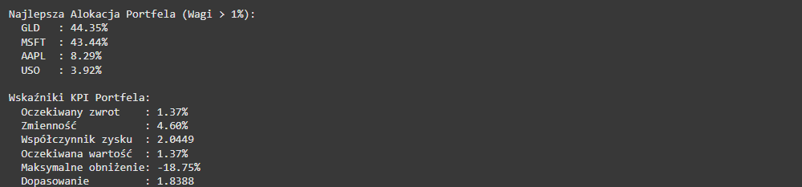
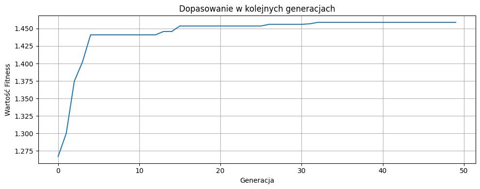

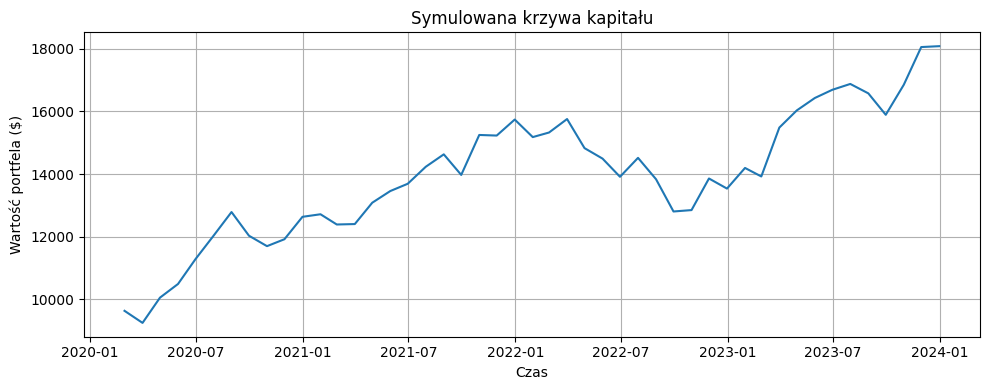

#### Przykład 2: Optymalizacja portfela dla profilu agresywnego z większą liczbą generacji

1. Wybierz profil "Agresywny" z listy rozwijanej
2. Ustaw datę początkową na 01/01/2021 i datę końcową na 31/12/2023 (krótszy okres analizy)
3. Zwiększ liczbę generacji do 100 (dla lepszej optymalizacji)
4. Zwiększ wielkość populacji do 150
5. Wyniki:

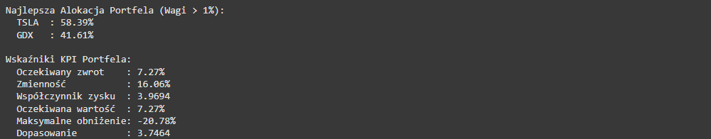
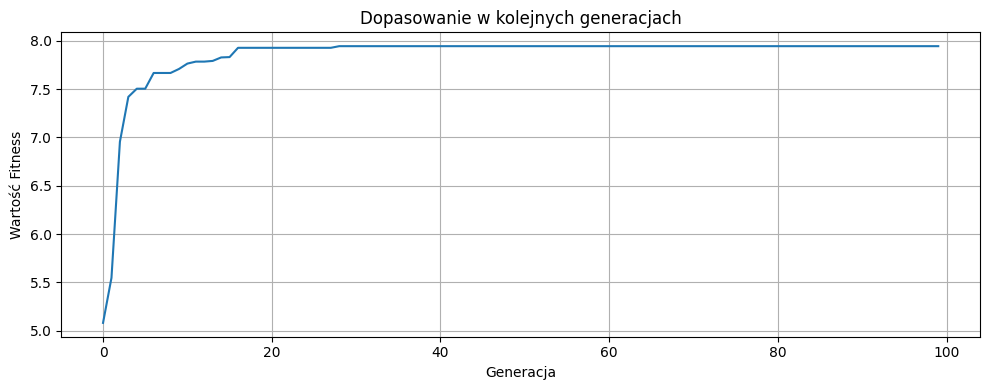
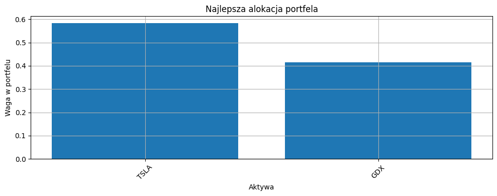
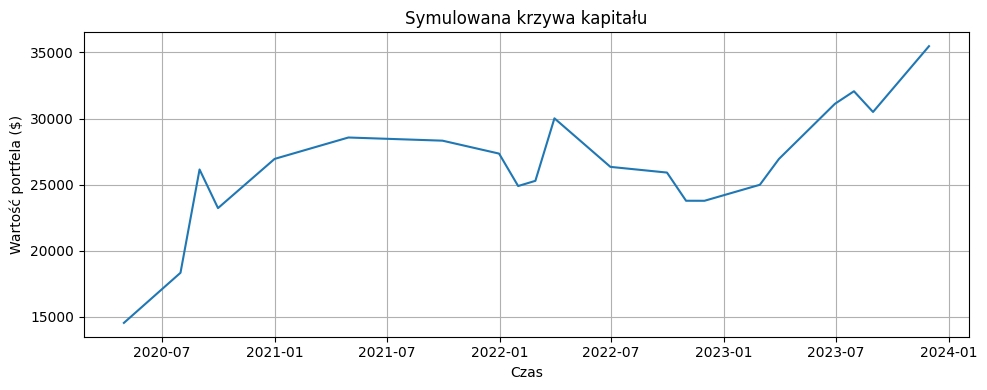

#### Przykład 3: Optymalizacja portfela dla profilu konserwatywnego z niższym wskaźnikiem mutacji

1. Wybierz profil "Konserwatywny" z listy rozwijanej
2. Ustaw datę początkową na 01/01/2020 i datę końcową na 31/12/2023
3. Zmniejsz wskaźnik mutacji do 0.02 (dla mniejszej losowości i większej stabilności)
4. Wyniki:

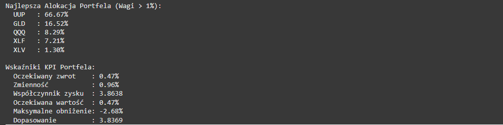
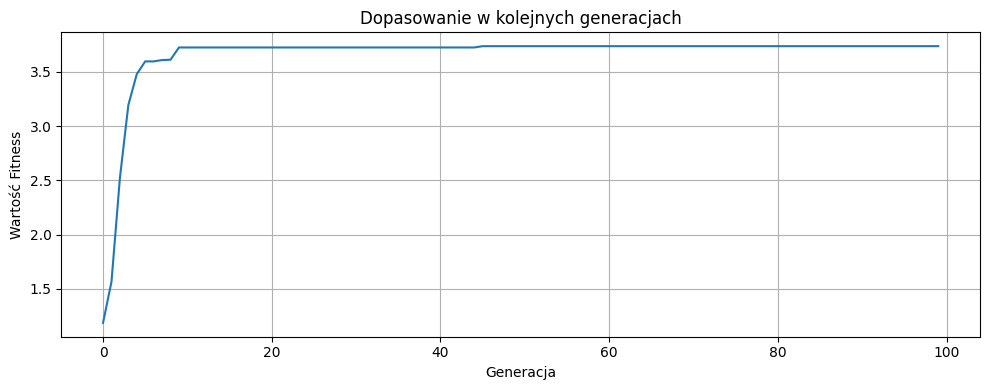
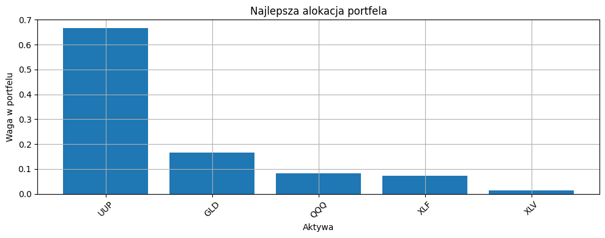
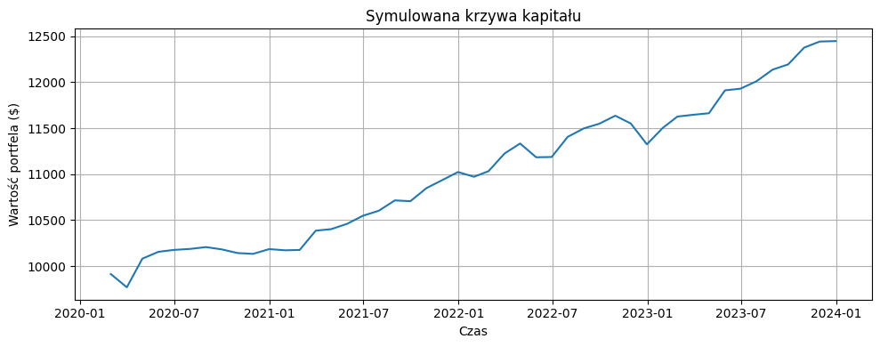

<div style="page-break-after: always;"></div>

## Spis literatury

- Algorytmy genetyczne. Kompendium, t. 1. Tomasz Dominik Gwiazda, Wydawnictwo Naukowe PWN 2020.
- [Genetic Algorithm: Complete Guide With Python Implementation](https://www.datacamp.com/tutorial/genetic-algorithm-python)
- [Genetic Algorithms for Trading in Python](https://www.pyquantnews.com/free-python-resources/genetic-algorithms-for-trading-in-python)
- [Unleashing the Power of Genetic Algorithms: Boost Your Portfolio Performance with Python](https://medium.com/geekculture/optimizing-portfolio-performance-with-genetic-algorithms-in-python-a-data-science-approach-970abc07c649)
